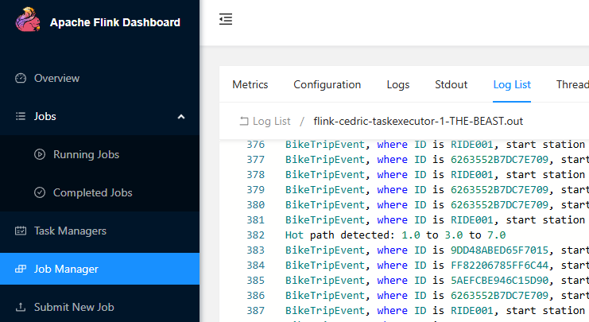

# Project 1 V2 - FlinkCEP

## For the TA grading this

If you want to try to run this code yourself, you can find the installation instructions below to install the correct tools locally. If you want to use the CitiBike dataset, you can run the `/datasets/download_datafiles.sh`-script.

The code that is to be evaluated is found under the `/code/src/main/java/org/myorg/mycep`-directory. It contains the four code files mentioned to in the report.

The data collected and displayed in the report was taken from the files found in the `/output/final`-directory. For each latency bound, we ran the program three times and took the average the three runs. This explains the naming convention for the files. E.g., when testing the latency bound of 100ms, the three files `100_1`, `100_2`, and `100_3` were used.

## Tools

- `java -version`: 11.0.28
- `javac -version`: 11.0.28
- `mvn -version`: 3.8.6
- `flink --version`: 2.1.0

## Flink docs

[Here](https://nightlies.apache.org/flink/flink-docs-release-2.1/docs/libs/cep/)

### Installing Java and Maven using SDKMAN

Installing Java and Maven versions is easiest using SDKMAN. Follow [this](https://sdkman.io/install/) guide on how to do it, but simply run these command:

`curl -s "https://get.sdkman.io" | bash && source "$HOME/.sdkman/bin/sdkman-init.sh"`.

Then, verify with `sdk version`.

To install the correct Java version, simply run:

`sdk install java 11.0.28-tem`.

It should set this Java version as your default - look for the line _Setting java 11.0.28-tem as default._ at the end of the output.

To install the correct Maven version, simply run:

`sdk install maven 3.8.6`

It should set this Maven version as your default - look for the line _Setting java 11.0.28-tem as default._ at the end of the output.

## Installing Flink and FlinkCEP

### Flink

To install Flink as outlined [on this page](https://nightlies.apache.org/flink/flink-docs-release-2.1/docs/try-flink/local_installation/), do the following:

1. Download Flink 2.1.0 from [this](https://www.apache.org/dyn/closer.lua/flink/flink-2.1.0/flink-2.1.0-bin-scala_2.12.tgz) page, or by clicking [this link](https://dlcdn.apache.org/flink/flink-2.1.0/flink-2.1.0-bin-scala_2.12.tgz)
2. Extract the file like so: `tar zxvf flink-2.1.0-bin-scala_2.12.tgz`
3. Add the FLINK_HOME env variable to you shell and add `$FLINK_HOME/bin` to your PATH variable
   1. E.g., add the following line `export FLINK_HOME=$HOME/flink-2.1.0` to your `.bashrc` or `.zshrc` file or which ever terminal config you use. Then add the path `$FLINK_HOME/bin` to you PATH variable
4. Open a new terminal and run `flink --version` to verify installation

## How to run a job

### Starting and stopping Flink

Start by starting the Flink cluster: `<path_to_flink_directort>/bin/start-cluster.sh`.

You can open the Flink dashboard via `http://localhost:8081/#/overview`

Stop the cluster when you're done: `<path_to_flink_directort>/bin/stop-cluster.sh`.

### Building and submitting the job

In the `code`-directory, run the following command to build the project: `mvn clean package`. It should build the .jar-file into the `/target`-directory.

Submit the job to Flink by running the following command from the `code`-directory: `flink run target/project1-0.1.jar`. Now you can see the job submitted in the Flink dashboard at `http://localhost:8081/#/overview`

Convenience command for compiling the code and submitting it, assuming you're running it from the `/code`-directory: `mvn clean package && flink run target/mycep-0.1.jar`

### Reading the output of the job

You can find the logs that are produced by the `result.print();`-line in the main java class (currently `BikeHotPathJob.java`) in a separate log file located at `$FLINK_HOME/log/flink-xxx-taskexecutor-xxx.out` file, or in the Flink Dashboard as in the image below.

