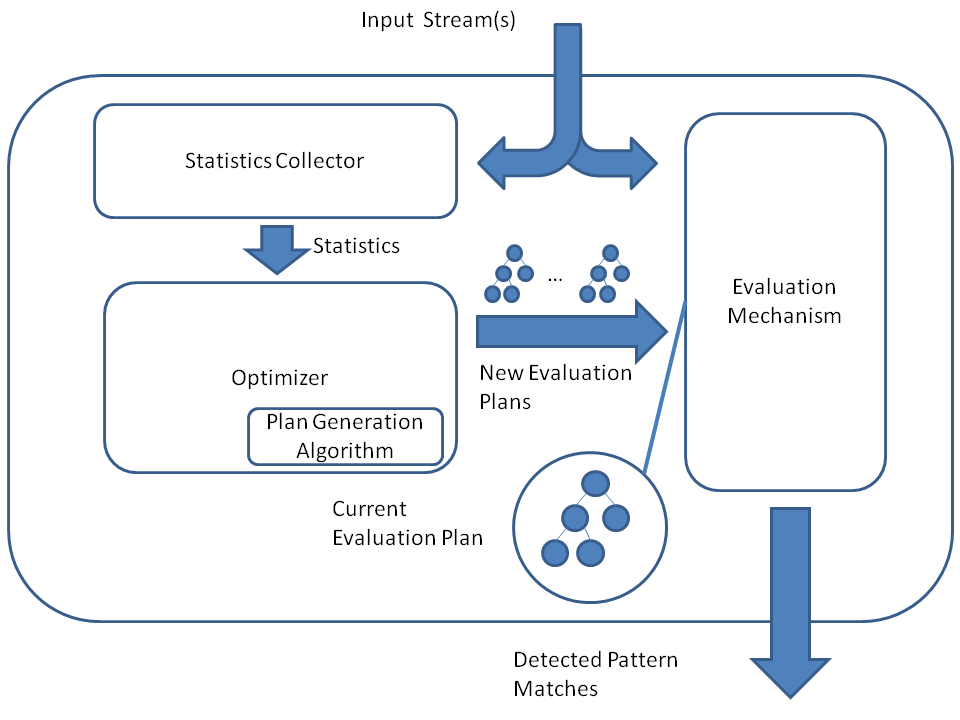

# Notes

## 09.09.2025 - Cedric

- Repo for my BDP course <https://github.com/CeduDev/BDP>
- CEP library and framework we MUST: <https://github.com/ilya-kolchinsky/OpenCEP>
- From the image below on the OpenCEP structure, the Statistics Collector and Optimizer are the ones that extract useful statistics and data characteristics, and apply optimization techniques - such as highly complex and deeply nested patterns, tight constraints on response time and detection precision, and processing multiple patterns and stream in parallel - to maximize the performance of the evaluation mechanism (which handles the actual pattern matching).
  
- Requirements in short:
  - Given the "hot paths" detection query provided, we need to _implement the state management of partial matches for the query_, including load shedding strategies to handle bursty workloads while ensuring low-latency processing.
    - The measure of success will be the ability to process incoming events with (1) low **latency**, even under high load conditions, while (2) maintaining the **recall** of pattern detection.
  - Focus on:
    1. Measure the overload detection **latency** and **throughput** under bursty workloads
    2. Implement a **load shedding** strategy that balances **latency** and **recall** under bursts (e.g., prioritizing longer chains nearing completion at target stations 7,8,9 within 1h)
    3. Evaluate the effectiveness of the **shedding** strategy in maintaining low **latency** while maximizing **recall**
  - Create a 4 page report using the ACM Proceeding Template (latex or word)
- Key words:
  - **Latency**: Time between arrival (or event time (i.e. timestamp in the actual data)) of the last contributing primitive event (i.e. data point) and emission of the complex event result. Simply, how long it takes to complete the complex event pattern from when the LAST event in the pattern arrived or based on its event time
  - **Recall**: Fraction of true pattern matches still reported after any shedding (measures correctness under best-effort mode).
  - **Throughput**: Number of primitive events processed per second.
  - **Load shedding**: Intentional dropping or early termination of processing for some events or partial matches under resource pressure to keep latency bounded.
- Key things to figure out:
  - What all is provided by OpenCEP and what do we need to actually do ourselves
    - How are we gonna handle load shedding during periods of elevated load?
    - I'm assuming we don't need to use a separate database (e.g. Cassandra) nor stream processing technology (e.g. Kafka). NEED TO VERIFY BY CHECKING INTO THIS!
  - FlinkCEP? Do we need/use it?
  - How do we ingest the data to the OpenCEP engine?
  - How do we actually do any of this :D
- Next thing to do:
  - Study OpenCEP to see how it actually works and what to do
